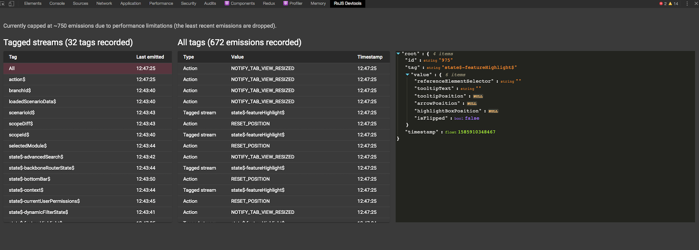

## RxJS DevTools for debugging streams
This extension allows you to debug your RxJS stream emissions by hooking into the [rxjs-spy](https://github.com/cartant/rxjs-spy) debugging library.

The project was inspired by [rxjs-spy-devtools](https://github.com/cartant/rxjs-spy-devtools).

## How to use in your app
1. [Install the chrome extension](#installing-the-extension-in-developer-mode)
2. Set up [rxjs-spy-devtools-plugin](https://github.com/ardoq/rxjs-devtools/tree/master/packages/rxjs-spy-devtools-plugin) in your app and [tag the streams](https://github.com/cartant/rxjs-spy#core-concepts) that you wish to inspect in the devtools.

## Structure & Philosophy
The repo is split into three packages:
- **[packages/rxjs-spy-devtools-plugin](packages/rxjs-spy-devtools-plugin/README.md)**: plugin for [rxjs-spy](https://github.com/cartant/rxjs-spy) that sends info about stream emissions to the dev tools extension
- **packages/extension**: chrome extension for the devtools
- **packages/shared**: shared types, interfaces and utils for communication between the rxjs-spy plugin and the extension

Although the extension currently depends on [rxjs-spy-devtools-plugin](packages/rxjs-spy-devtools-plugin/README.md) to receive info about stream emissions. In theory this repository can be extended with another plugin that sends info about stream emissions in a different manner.

## Installing the extension in developer mode
1. `git clone` this repository
2. `cd packages/extension`
3. `yarn install ` to install the dependencies.
4. `yarn build`
5. Load the extension in Chrome:
   1. Access `chrome://extensions/`
   2. Check `Developer mode`
   3. Click on `Load unpacked extension`
   4. Select the `packages/extension/build` folder
6. You should now see `RxJS Devtools` as a tab in dev tools.

## Developing the extension
1. cd `packages/extension`
2. Run `yarn install` to install the dependencies.
3. Run `yarn start`
4. Load the extension in Chrome:
   1. Access `chrome://extensions/`
   2. Check `Developer mode`
   3. Click on `Load unpacked extension`
   4. Select the `packages/extension/build` folder.
5. Happy hacking!

